# ***Programming Introduction.***

## 1. *Computer Components*
A computer system is made of two major components: hardware and software. The computer hardware is the physical equipment. The software is the collection of programs (instructions) that allow the hardware to do its job.

**1.1. Hardware Components :**
- CPU 
- Main Memory
- secondry memory
- input and output systems
- communication systems

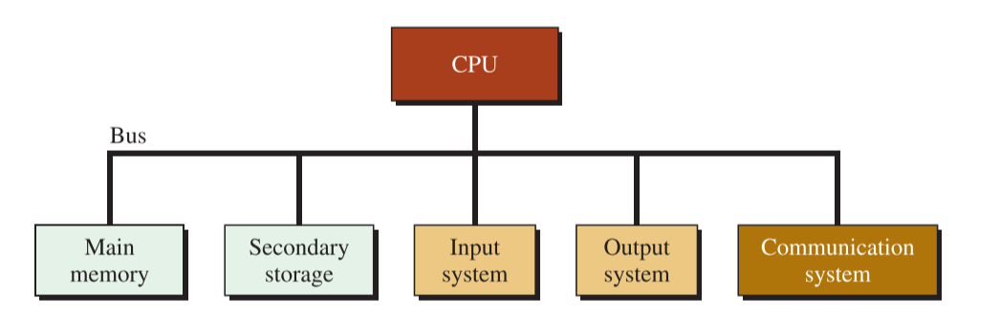

**Main Memory (Primary Memory or RAM):**

- is where programs and data are stored temporarily during processing.
- The contents of primary memory are lost when we turn off the computer.
- RAM is the main memory in a computer. It is much faster to read from and write to than other kinds of storage, such as a hard disk drive (HDD), solid-state drive (SSD) or optical drive.

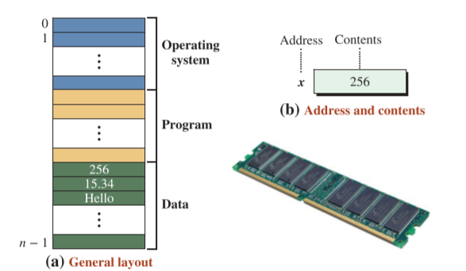

- In general, primary memory is used for three purposes: to store the operating system, to store the program, and to store data.

**1.2. Software Components :**

Your system has three basic types of software: application programs, device drivers, and operating systems. Each type of software performs a completely different job, but all three work closely together to perform useful work.

**1.2.1 Application Programs**

Application programs are the top software layer. You can perform specific tasks with these programs for example word application you use it to make a file which is a special task  


The other two layers, device drivers and the operating system, play important support roles. Your system might run one application program at a time, or it might run many simultaneously.

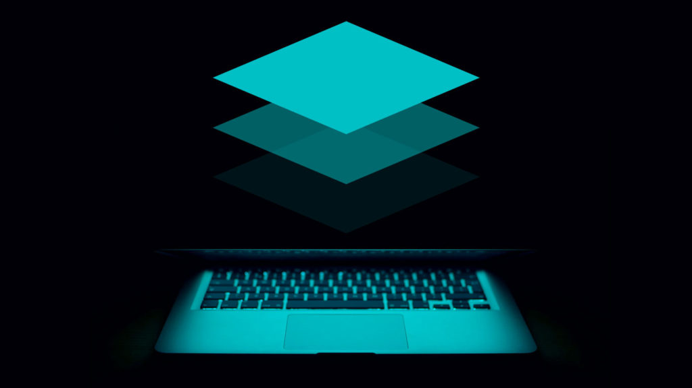

**1.2.1 Device Drivers**

Device drivers are a set of highly specialized programs. Device drivers help application programs and the operating system do their tasks. Device drivers (in particular, adapters), do not interact with you. They interact directly with computer hardware elements and shield the application programs from the hardware specifics of computers.

**1.2.1 Device Drivers**

The operating system provides services such as a user interface, file and database access, and interfaces to communication systems. The primary purpose of this software is to operate the system in an efficient manner while allowing users access to the
system.

## 2. *Computer Language*

if you go to resturant and find that water is English man you need english language to communicate with him and make him understand what you need from him to do , now english is a tool to communicate with him , programming languages like this , To write a program for a computer, we must use a computer language. Over the years, computer languages have evolved from machine to symbolic to high-level languages and
beyond.

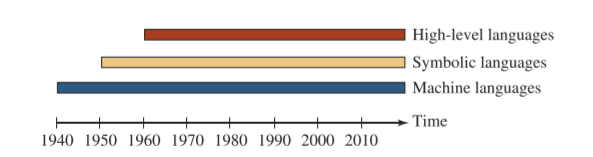

In the earliest days of computers, the only programming languages available were machine languages. While each computer still has its own machine language, which is made of
streams of 0s and 1s, we no longer program in machine language. It became obvious that not many programs would be written if programmers continued to work in machine language , so it was be nessesary to develop way to do it .

In the early 1950s, Grace Hopper, a mathematician and a member of the United States Navy, developed the concept of a special computer program for converting programs into machine language , which was assembly languages or Symbolic Languages .

The desire to improve programmer efficiency and to change the focus from the computer to the problem being solved led to the development of high-level languages.

high-level languages share one thing with symbolic languages: They must be converted to machine language , This process is called **compilation**.

The first widely used high-level language, **FORTRAN** (Formula Translation), was created by John Backus and an IBM team in 1957. Following soon after FORTRAN was COBOL (Common Business-Oriented Language). Admiral Grace Hopper was again a key
figure, this time in the development of the **COBOL** business language.

Over the years, several other languages most notably BASIC, Pascal, Ada, C, C++, and Java were developed. Today, one of the popular high level languages for system software and new application code is C++ .

### **But what About Paradigms**

Computer languages can be categorized according to the approach they use in solving a problem.

A **paradigm** is a model or a framework for describing how a program handles data. Although there are several taxonomies for dividing current languages into a set of paradigms, we
discuss only there : procedural, object-oriented and functional .

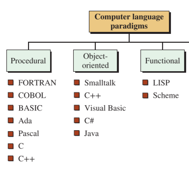

### *What Is the C++ Language?*

C++ is a progressive programming language derived from its predecessors, the C language and the B language. The C++ language expands the idea of a struct to a class in which different objects can be created from one single definition of a class with different values for
each data element.

Furthermore, the C++ language explores the idea of object-oriented languages that simulate real life. In real life, we define a type and then we have objects of that type. In the
C++ language, we define a class and then we create objects from that class.

The most recent additions to C++ include the Standard Template Library (STL), a collection of predefined complex objects and actions that can be applied to those objects, as
well as design patterns to make problem solving more efficient and coherent.


## 3. *Solve Problem* 

- Understand the problem : We begin by reading the statement carefully , when we fully understand the problem try our approach in paper to make sure that we understand the problem .

- how to take input and convert it to needed output .

- make sure that I don't make wrong assumptions .

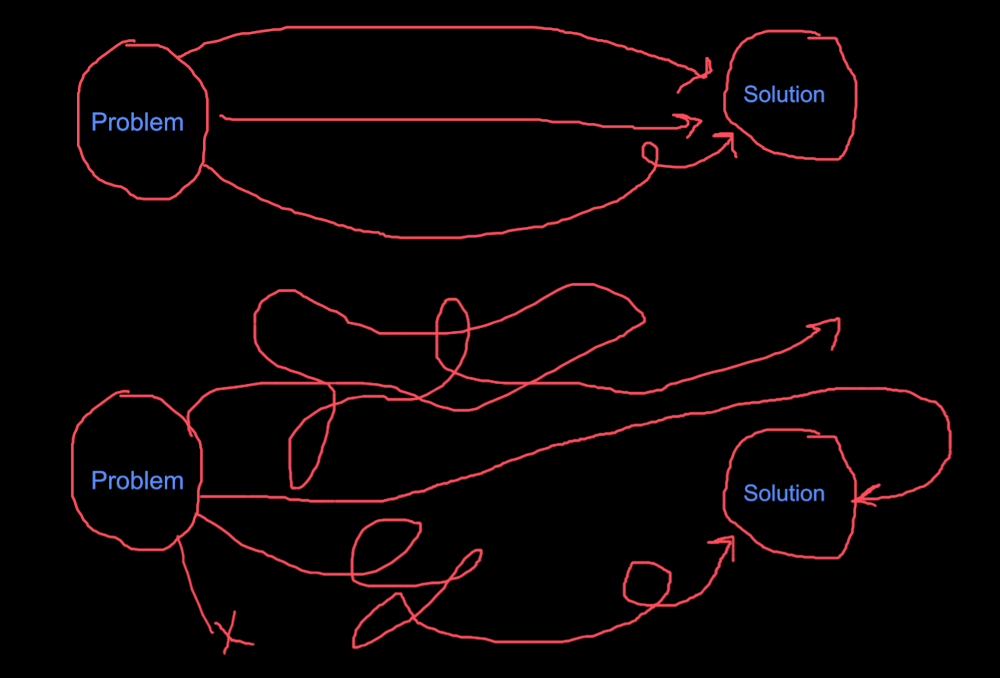

- Improve my soltuation and think if there is a better solution (Algorithm).
## 4. *Errors*
### **Syntax Vs Semantics.** 

**4.1 Syntax Errors**

These are also referred to as compilation Error ,These errors have occurred when the rule of C++ writing techniques or syntax has been broken. These types of errors are typically flagged by the compiler prior to compilation.

Note*

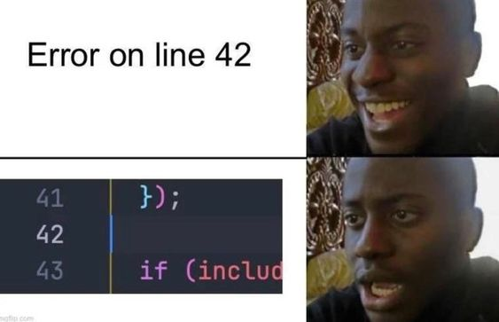

when you forget a `;` you get error in next line :> .

**4.2 Runtime Errors**

This type of error occurs while the program is running. Because this is not a compilation error, the compilation will be completed successfully.

**4.3. Logical Errors**

Even if the syntax and other factors are correct, we may not get the desired results due to logical issues. These are referred to as logical errors.


## 5. *First Program*

```cpp
#include<iostream>
using namespace std;

int main(){
    cout << "Hello World!" << endl ;

    return 0 ;
}
```

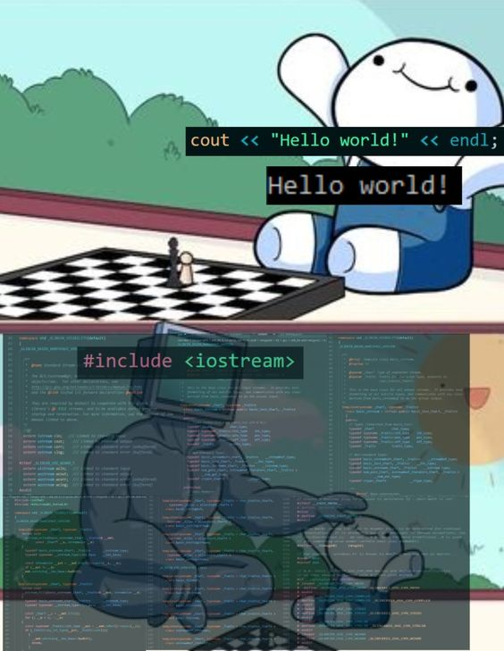

**Note** -> C++ language is case-sensitive. The term that names an entity must be used as it is defined without changing the case of its letters.

## 6. *Varibles and Data Types*
### 6.1 **Varibles**
Programs written in the C++ language receive input data, manipulate them, and create output data. Since the input and output data may change, we must be able to store the input
data, store the intermediate data, and store the output data in memory.

For this reason, C++, like most programming languages, uses the concept of variables. A **variable** in computer language parlance is a memory chunk that needs to have a name and a type.It is called a variable because its contents may change during the execution of the program. It’s purpose is to store and retrieve data. It must have a type because we use different data types for
different purposes.

``` cpp
varible_type varible_name ; // declaretion 
varible_type varible_name = value ; // initializion 
```
### Rules of Name a variable 
1. Names can contain letters, digits and underscores.
2. Names must begin with a letter or an underscore (_)
3. Names are case sensitive (`myVar` and `myvar` are different variables)
4. Names cannot contain whitespaces or special characters like !, #, %, etc.
5. Reserved words (like C++ keywords, such as `int`) cannot be used as names.
### 6.2 **Take Input and give Output :**

```cpp
cout << object or varible ;
```
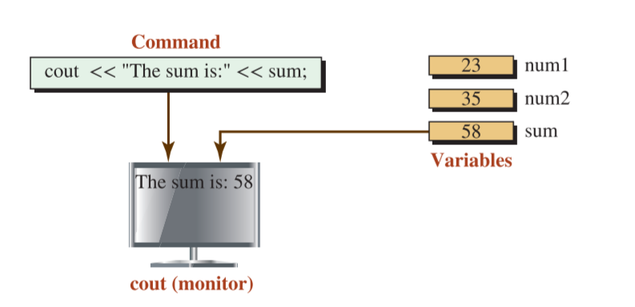

```cpp
cin >> varible or object ;
```
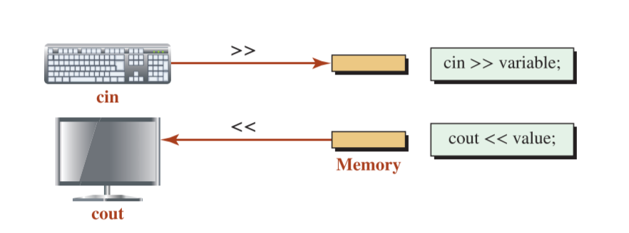

- The cin object needs to see a variable name .
- the cout object needs to see a value.

### 6.3 **constants :**
A constant is a storage entity whose value cannot be changed. Its value is fixed. we qualify the name with the **const** modifier . and better to make his name is upper case laters .
```cpp
const double PI = 3.1415926535897932384626433832795 ;
```

### 6.4 **Comment :**
```cpp
// this is a single line comment


/*
this is 
multiple lines 
comment 
*/
```

### 6.5 **Data Types**
The number of data types defined in the C++ language is very large, but we can divide these types into two broad categories:
built-in and user-defined, with each category divided into two groups as shown in Figure :

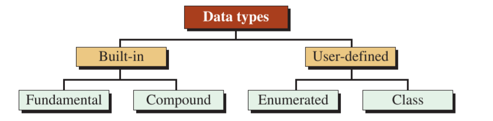

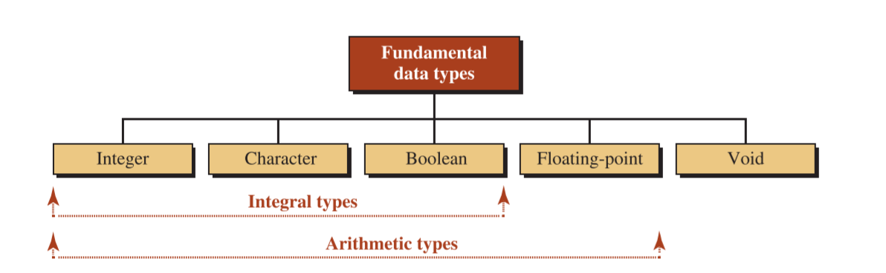

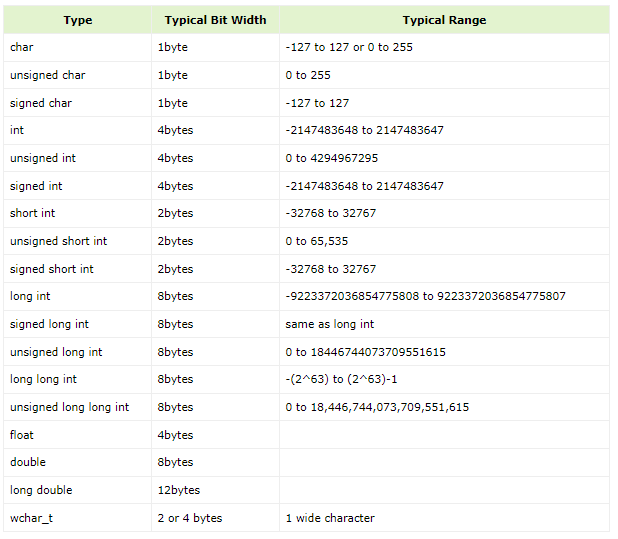

### 6.6 **special characters**
```cpp
    cout << "Hello World!\n" ;
```
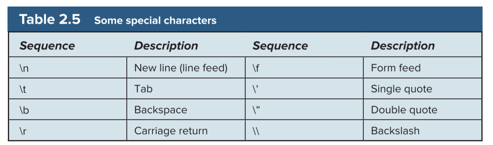
## 7. *ASCII and Operators* 
### 7.1.  **C++ Operators:**
Operators are used to perform operations on variables and values.
In the example below, we use the `+` **operator** to add together two values:

```cpp
int sum1 = 100 + 50;        // 150 (100 + 50)
int sum2 = sum1 + 250;      // 400 (150 + 250)
int sum3 = sum2 + sum2;     // 800 (400 + 400)
```
1. Arithmetic operations :
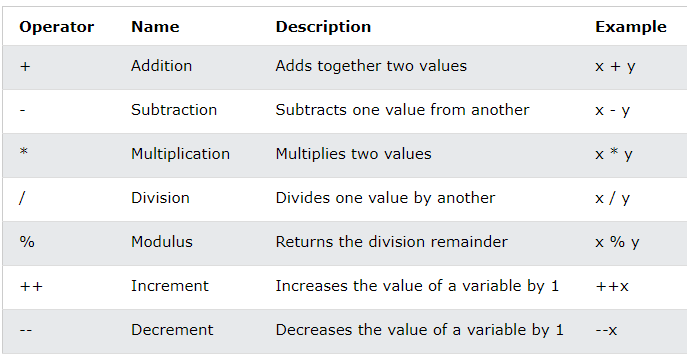
2. Assignment Operations :
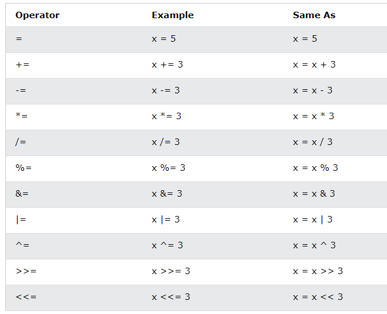
Note*
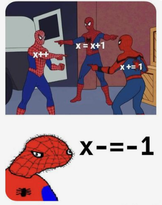

3. Comparison operations :
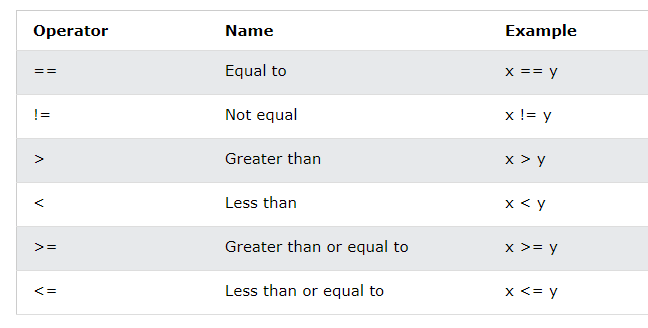
4. Logical Operations :
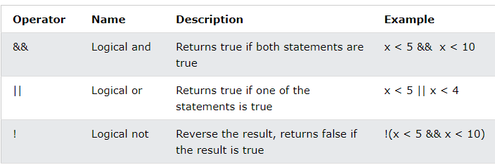

### 7.2.  **ASCII CODE :**
every character represent as an number called Ascii code store in memory.

Example :
```cpp
#include <iostream>
using namespace std;

int main() {
 char c;
 cout << "Enter a character: ";
 cin >> c;
 cout << "ASCII Value of " << c << " is " << int(c);
 return 0;
}
```
Output :
```consle 
Enter a character: p
ASCII Value of p is 112
```
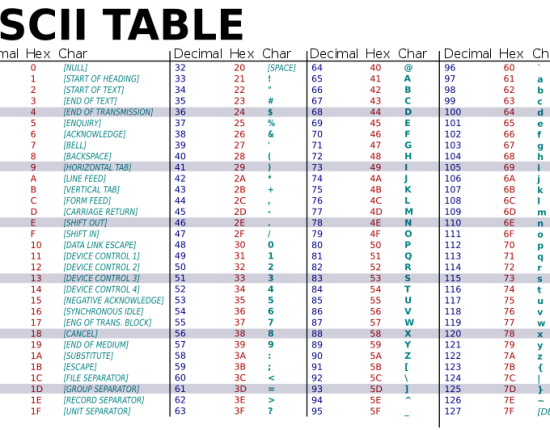
## At the End :
 هذا وما كان من توفيق فمن الله، وما كان من خطأ أو سهو أو زلل أو نسيان فمني ومن الشيطان والحمدلله .

 سُبْحَانَكَ اللَّهُمَّ وَبِحَمْدِكَ، أَشْهَدُ أَنْ لَا إِلَهَ إِلَّا أَنْتَ أَسْتَغْفِرُكَ وَأَتُوبُ إِلَيْكَ
## Resources : 
1. C++ programming : An Object-Oriented Approach , by Behrouz A. Forouzan, Richard Gilberg .
2. [geeksforgeeks](https://www.geeksforgeeks.org/cpp-program-to-show-types-of-errors/)
3. [Ualberta University blog](https://sites.ualberta.ca/dept/chemeng/AIX-43/share/man/info/C/a_doc_lib/aixuser/aixqbeg/sys_sfw_comps.htm)
3. [TechTarget](https://www.techtarget.com/searchstorage/definition/RAM-random-access-memory)
5. [W3schools](https://www.w3schools.com/cpp/cpp_variables_identifiers.asp)
6. [tutorialpoint](https://www.tutorialspoint.com/cplusplus/cpp_data_types.htm)
7. [W3schools](https://www.w3schools.com/cpp/cpp_operators.asp)

## Sheet Link and Quiz :


