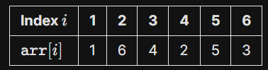

# ***Prefix Sum***

## Motivation
If I have array of size $n$, and want to answer $q$ questions in form what the sum of element from $l$ to $r$ is ?

for first time it look easy can solve as following :
```cpp
#include<iostream>
using namespace std;

int main(){
    int n ; // size of array 
    cin >> n ;
    int arr[n] ; // declare the array
    for(int i = 0 ; i < n ; i ++)
        cin >> arr[i] ; // input the array elements
    int q ; cin >> q ; // take the number of questions
    for(int i = 0 ; i < q ; i ++){
        int l , r ;
        cin >> l >> r ; // take the start and end of intervail
        int ans = 0 ;
        for(int j = l - 1 ; j < r ; j ++)
            // note we start l - 1 as it 0-indexed 
            // for example : if he mean l = 0 index will say 1
            ans += arr[j] ;
        cout << ans << endl ;
    }
}
```

### But, What wrong in this ?
### But, First what is its time complexity ? 
if we look to block again :
```cpp
#include<iostream>
using namespace std;

int main(){
    int n ; 
    cin >> n ;
    int arr[n] ; 
    for(int i = 0 ; i < n ; i ++)
        cin >> arr[i] ; // o(n)
    int q ; cin >> q ; 
    for(int i = 0 ; i < q ; i ++){ // o(q)
        int l , r ;
        cin >> l >> r ;
        int ans = 0 ;
        for(int j = l - 1 ; j < r ; j ++)
            ans += arr[j] ; // o(n)
        cout << ans << endl ;
    }
}
```
So we will find time complexity is $O(qn)$, The problem is that if $n = 10^5$ and $q = 10^5$ it will take $4*10^{10}$ !!!!!!!!!!!!!!!!

So go on to see how to solve this problem.
## Range Query

the idea is to precompute the values, **but How ?**

Let's say we have a one-indexed integer array $\texttt{arr}$ of size $n$ and we
want to compute the sum of values from $l$ to $r$, where $(1 \leq l \leq r \leq n)$ So : 

$$Sum = \texttt{arr}[l]+\texttt{arr}[l+1]+\cdots+\texttt{arr}[r]$$

let that $n = 6$ and array as following :



We can create a new array where every element have vaule of the index in $arr$ and all previous elements, **But How?**

1. Let call array name is $pref$ and set this size to be $n + 1$ .
2. Set the first element to be zero, $pref[0] = 0$.
3. So $pref[1] = pref[0] + arr[1]$ and the second element is $pref[2] = pref[1] + arr[2]$, **you note?** every element in $pref$ will equal to the previous element in $pref$ and $arr$ in this formula , where $(1 \leq l \leq r \leq n)$:
$$pref[i] = pref[i - 1] + arr[i]$$


The finael result of oue example :


* ***Note*** : here the start of $arr$ from $1$ to $n$ and $pref$ from $0$ to $n$

Now How can we answer queries of questions we say in motivation ?

We can say that :
$$sum(l,r) = sum(0,r) - sum(0,l - 1)$$
Which same as :
$$pref[r] = pref[r] - pref[l - 1] $$
You should know now why we set size of $pref$ to be $n + 1$ as if he wanted the sum from $l = 1$ to $r$ the $arr[l - 1]$ will be runtime error !

from previous example the sum from $l = 3$ to $r = 5$ will be $pref[5] = pref[5] - pref[2] = 18 - 7 = 11$ which equal to $arr[3] + arr[4] + arr[5] = 4 + 2 + 5 = 11$
### How to Implement it ?
```cpp
#include<iostream>
using namespace std;

int main(){
    int n ; // size of array 
    cin >> n ;
    int arr[n + 1] ; // declare the array
    for(int i = 1 ; i <= n ; i ++)
        cin >> arr[i] ; // input the array elements
    int pref[n + 1] ;
    pref[0] = 0 ; // set first element to zero.
    for(int i = 1 ; i <= n ; i ++)
        pref[i] = pref[i - 1] + arr[i] ; // precomute the prefix sum array .
    int q ; cin >> q ; // take the number of questions
    for(int i = 0 ; i < q ; i ++){
        int l , r ;
        cin >> l >> r ; // take the start and end of intervail
        cout << pref[r] - pref[l - 1] << endl ;
    }
}
```
We can now answer any question in $O(1)$ so the time complexity of code is $O(max(n,q))$, we do it 🥳
### Notes :
- we can do sufix in the same way.
- alwous the problems not in this direct form so let see some ideas.

### **Applications**
1. ***Segements***
        
        if I have number line and some segments in form [l : r] and need to know the point who have more than segments pass throw it .


## **2D Prefix Sum** :
It is also possible to generalize this idea to higher dimensions. For example,
we can construct a two-dimensional prefix sum array that can be used to calculate
the sum of any rectangular subarray in $O(1)$ like this :


We need to calculate the sum of blue block which is $7+11+9+6+1+3 = 37$.

We can do it in same way as above, where cell $a$ is the sum of all elements above it.:


In two steps :
1. First, every element equal to the all previous elements in same row.
```cpp
    for(int i = 1 ; i <= n ;i ++){
        for(int j = 1 ; j <= m ; j ++){
            pref[i][j] = pref[i][j - 1] + arr[i][j] ;
        }
    }
```
2. second, every element equal to the sum of element above it.
```cpp
    for(int i = 1 ; i <= n ;i ++){
        for(int j = 1 ; j <= m ; j ++){
            pref[i][j] += pref[i - 1][j] ;
        }
    }
```
We magically do it 😱😳, we now have 2D array $pref$ which each element is the sum of all element above it.

So to calculate the sum of rectangle we can do the followin :


$$
    sum(A,D) = sum(O,D) - sum(O,C) - sum(O,b) + sum(O,A) .
$$
Example : [Forest Queries](https://cses.fi/problemset/task/1652/)

```cpp
#include <iostream>
using namespace std;
int main() {
	int n ; cin >> n ; // take size of forest
	int q ; cin >> q ; // number of questions
	char arr[n + 1][n + 1] ;
	for(int i = 1 ; i <= n ; i ++)
		for(int j = 1 ; j <= n ; j ++)
			cin >> arr[i][j] ;
	int pref[n + 1][n + 1] ; // declare pref
	for(int i = 0 ; i <= n ; i ++)
		pref[i][0] = 0 ; // set boundries to zero
	for(int j = 0 ; j <= n ; j ++)
		pref[0][j] = 0 ; // set boundries to zero
	for(int i = 1 ; i <= n ; i ++)
		for(int j = 1 ; j <= n ; j ++)
			pref[i][j] = pref[i][j - 1] + (arr[i][j] == '*') ; // increase the prefix by one if containing tree
	for(int i = 1 ; i <= n ; i ++)
		for(int j = 1 ; j <= n ; j ++)
			pref[i][j] += pref[i - 1][j] ;
	for(int i = 0 ; i < q ; i ++){
		int x1 , y1 , x2 , y2 ;
		cin >> x1 >> y1 ;
		cin >> x2 >> y2 ;
		int ans = pref[x2][y2] - pref[x1 - 1][y2] - pref[x2][y1 - 1] + pref[x1 - 1][y1 - 1] ;
		cout << ans << endl ;
	}
	return 0;
}

```

## **Resources** : 
1 - [CPH Book](https://usaco.guide/CPH.pdf#page=94)

2 - [USACO Book](https://darrenyao.com/usacobook/cpp.pdf#page=60)

3 - [USACO guide](https://usaco.guide/silver/prefix-sums)

4 - [LeetCode Problemset](https://leetcode.com/tag/prefix-sum/)
