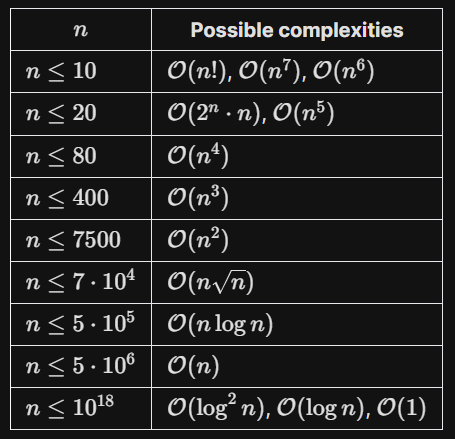
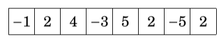
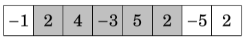

# ***Time and Space complexity***

### **how can determine the best solution ?**

Usually, it is easy to design an algorithm that solves the problem slowly, but the real challenge is to invent a optimized algorithm.

then we need tools to determine the best solution .

we can do it using two common scales :
- time complexity
- space complexity

## 1. Time Complexity

define :  The time complexity of an algorithm estimates how much time the algorithm will use for some input.

so we can determine if the code fast enough before implementing it .

### 1.1. Calculation rules

we use $O(f(n))$ to denote the time complexity, but how calculate it ? and what is n ?

**$O(f(n))$** : this called big O notation .

n denotes the input size we calculate the time related to the size of the input and for the one secand it take $10^8$ operations, but note it depends on anothe reson like the machine..etc.

so with this we can know if our solution is correct for this problem .

we calculate the time with sum of all time phases in code and take the bigger , first what phase and how to calculate for single phase and finaly for all phases .
```cpp
for (int i = 1; i <= n; i++)  // this is single phase 
{ 
    // code
}
for (int i = 1; i <= n; i++) // this is single phase 
{ 
    for (int j = 1; j <= n; j++) { 
        // code
    } 
}
for (int i = 1; i <= n; i++) // this is single phase 
{ 
    // code
}
```
each part of this code called phase, so how to calculate for every phase ?

**loops** 

A common reason why an algorithm is slow is that it contains many loops that go through the input. The more nested loops the algorithm contains, the slower it is.
If there are k nested loops .

for single loop :
```cpp
for (int i = 1; i <= n; i++)  // this is single phase 
{ 
    // code
}
```
it go from 1 to n so it take $O(n)$

for nested loop :
```c++
for (int i = 1; i <= n; i++) // this is single phase 
{ 
    for (int j = 1; j <= i; j++) { 
        // code
    } 
}
```
the inner loop time like $O(1 + 2 +.....+n)$ so then go for outer loop it will take $O(n)$ so $O(n*(1 + 2 +.....+n)) = O(n + 2n + ...+ n^2 )$ which equal to $O(n^2)$ . we will talk about it later, 

if there is more than one nested loop k loops for eample :

so time comolexity = $O(n_1*n_2*.....*n_k)$ .

**note** : big O notation representate the worst possible case .
we come know for thing .

### 1.2. Order of magnitude

we in previes example convert $O(n + 2n + ...+ n^2 )$ to $O(n^2)$ .

it look like $1.455743 \cong 1.5$ we neglect things in notation what don't matter .  

we take the big part and neglect the constants like multiplicate by 3 or 2 and add 13233, and this is what we do with phases we calculate the big of every pahse and take the biggest one .
```cpp
for (int i = 1; i <= n; i++)  // this is single phase 
{ 
    // code
}
for (int i = 1; i <= n; i++) // this is single phase 
{ 
    for (int j = 1; j <= n; j++) { 
        // code
    } 
}
for (int i = 1; i <= n; i++) // this is single phase 
{ 
    // code
}
```
**solution :**

first phase : $O(n)$ , second phase : $O(n^2)$ , third phase : $O(n)$.

so the total $O(n + n^2 + n) \cong O(n^2)$ : we take the biggest phase .

A time complexity does not tell us the exact number of times the code inside a loop is executed, but it only shows the order of magnitude. In the following examples, the code inside the loop is executed $3n$, $n+5$ and $n/2$ times, but the
time complexity of each code is $O(n)$.


**Constant Factor**

Constant factor refers to the idea that different operations with the same
complexity take slightly different amounts of time to run. For example, three
addition operations take a bit longer than a single addition operation. Another
example is that although binary search on an array and insertion into an ordered
set are both $\mathcal{O}(\log n)$, binary search is noticeably faster.

Constant factor is entirely ignored in Big O notation. This is fine most of
the time, but if the time limit is particularly tight, you may receive time
limit exceeded (TLE) with the intended complexity. When this happens, it is
important to keep the constant factor in mind. For example, a piece of code that
iterates through all ordered triplets runs in $\mathcal{O}(n^3)$ time might be
sped up by a factor of $6$ if we only need to iterate through all unordered
triplets.


For now, don't worry about optimizing constant factors -- just be aware of them.

### 1.3. Recursion 

The time complexity of a recursive function depends on the number of times the function is called and the time complexity of a single call. The total time
complexity is the product of these values.

$time complexity =  O(time of signal call * number of calls ).$

example : 
```cpp
void f(int n) { 
    if (n == 1) return; 
    f(n-1);
}
```
$time complexity =  O(1 * n ) = O(n) .$

The call f(n) causes n function calls, and the time complexity of each call is O(1). Thus, the total time complexity is O(n).

example : 
```cpp
void g(int n) { 
    if (n == 1) 
        return; 
    g(n-1); g(n-1);
}
```
In this case each function call generates two other calls, except for $n= 1$. Let us see what happens when $g$ is called with parameter $n$. The following table shows
the function calls produced by this single call:

| function call | number of calls |
|---------------|-----------------|
|$g(n)$         | 1               |
|$g(n - 1)$     | 2               |
|$g(n - 2)$     | 4               |
|.......        |.....            |
|$g(1)$         | $2^{n - 1}$     |

Based on this, the time complexity is : 
$$ 1 + 2 + 4 +...+2^{n - 1} = 2^n - 1 = O(2^n) .$$

### 1.4. Complexity classes

The following list contains common time complexities of algorithms: 

$O(1)$ : The running time of a constant-time algorithm does not depend on the input size. A typical constant-time algorithm is a direct formula that
calculates the answer.

$O(\log{n})$ : A logarithmic algorithm often halves the input size at each step. The running time of such an algorithm is logarithmic, because log2 n equals the
number of times n must be divided by 2 to get 1.

$O(\sqrt{n})$ : A square root algorithm is slower than $O(\log{n})$ but faster than $O(n)$. A special property of square roots is that $n= n/\sqrt{n}$, so the square root $\sqrt{n}$
lies, in some sense, in the middle of the input .

$O(n)$ : A linear algorithm goes through the input a constant number oftimes. This is often the best possible time complexity, because it is usually necessary to
access each input element at least once before reporting the answer.

$O(n\log{n})$ : This time complexity often indicates that the algorithm sorts the input, because the time complexity of efficient sorting algorithms is $O(n\log{n})$. Another possibility is that the algorithm uses a data structure where each
operation takes $O(\sqrt{n})$ time.

$O(n^2)$ : A quadratic algorithm often contains two nested loops. It is possible to go through all pairs of the input elements in O(n2) time. 

$O(n^3)$ : A cubic algorithm often contains three nested loops. It is possible to go through all triplets of the input elements in $O(n^3)$ time.

$O(2^n)$ : This time complexity often indicates that the algorithm iterates through all subsets of the input elements. For example, the subsets : {1,2,3} are $\empty$, {1}, {2}, {3}, {1,2}, {1,3}, {2,3} and {1,2,3}.

$O(n!)$ : This time complexity often indicates that the algorithm iterates through all permutations of the input elements. For example, the permutations of
{1,2,3} are (1,2, 3), (1,3, 2), (2,1, 3), (2,3, 1), (3,1,2) and (3,2, 1).


Complexity Growth Illustration from [Big O Cheatsheet](http://bigocheatsheet.com/) .

### 1.5. Estimating efficiency

By calculating the time complexity of an algorithm, it is possible to check, before implementing the algorithm, that it is efficient enough for the problem. The starting point for estimations is the fact that a modern computer can perform some hundreds of millions of operations in a second. For example, assume that the time limit for a problem is one second and the
input size is $n = 10^5 $. If the time complexity is $O(n^2)$, the algorithm will perform about $(10^5)^2 = 10^{10} $ operations. This should take at least some tens of seconds, so the algorithm seems to be too slow for solving the problem. On the other hand, given the input size, we can try to guess the required time
complexity of the algorithm that solves the problem. The following table contains
some useful estimates assuming a time limit of one second.

Here are conservative upper bounds on the value of $n$ for each time complexity. You might get away with more than this, but this should allow you to quickly check whether an algorithm is viable.



## **Example to improve Idea :**

[**Maximum subarray sum**](https://leetcode.com/problems/maximum-subarray/) :

There are often several possible algorithms for solving a problem such that their time complexities are different. This section discusses a classic problem that has a straightforward $O(n^3)$ solution. However, by designing a better algorithm, it is possible to solve the problem in $O(n^2)$ time and even in $O(n)$ time. Given an array of n numbers, our task is to calculate **the maximum subarray sum**, i.e., the largest possible sum of a sequence of consecutive values in the array2. The problem is interesting when there may be negative values in the
array. For example, in the array



the following subarray produces the maximum sum 10:



**note :** We assume that an empty subarray is allowed, so the maximum subarray sum is always at least 0.

## Algorithm 1 :

A bruteforce way to solve the problem is to go through all possible subarrays, calculate the sum of values in each subarray and maintain the maximum sum.
The following code implements this algorithm:
```cpp
int best = 0;
for (int a = 0; a < n; a++) { 
    for (int b = a; b < n; b++){ 
        int sum = 0;
        for (int k = a; k <= b; k++)
        { 
            sum += array[k];
        }
        best = max(best,sum); 
    }
}
cout << best << "\n";
```

The variables a and b fix the first and last index of the subarray, and the sum of values is calculated to the variable sum. The variable best contains the maximum sum found during the search. The time complexity of the algorithm is $O(n^3)$, because it consists of three nested loops that go through the input.

## Algorithm 2 :

It is easy to make Algorithm 1 more efficient by removing one loop from it. This is possible by calculating the sum at the same time when the right end of the subarray moves. The result is the following code:

```cpp
int best = 0;
for (int a = 0; a < n; a++) { 
    int sum = 0;
    for (int k = a; k <= b; k++){
        sum += array[k];
        best = max(best,sum);
    } 
}
cout << best << "\n";
```

After this change, the time complexity is $O(n^2)$.

## Algorithm 3 (Kadane’s algorithm):

Surprisingly, it is possible to solve the problem in $O(n)$ time3, which means that just one loop is enough. The idea is to calculate, for each array position, the maximum sum of a subarray that ends at that position. After this, the answer for the problem is the maximum of those sums. Consider the subproblem of finding the maximum-sum subarray that ends at
position $k$. 

There are two possibilities:

1. The subarray only contains the element at position $k$.
2. The subarray consists of a subarray that ends at position $k−1$, followed by the element at position $k$.

In the latter case, since we want to find a subarray with maximum sum, the subarray that ends at position $k−1$ should also have the maximum sum. Thus, we can solve the problem efficiently by calculating the maximum subarray sum for each ending position from left to right.
The following code implements the algorithm:

```cpp
int best = 0, sum = 0;
for (int k = 0; k < n; k++){ 
    sum = max(array[k],sum+array[k]);
    best = max(best,sum);
}
cout << best << "\n";
```
The algorithm only contains one loop that goes through the input, so the time complexity is $O(n)$. This is also the best possible time complexity, because any
algorithm for the problem has to examine all array elements at least once.

## 2. Space Complexity

definetion : Problem-solving using computer requires memory to hold temporary data or final result while the program is in execution. The amount of memory required by the algorithm to solve given problem is called space complexity of the algorithm.

To estimate the memory requirement we need to focus on two parts: 

1. A fixed part: It is independent of the input size. It includes memory for instructions (code), constants, variables, etc.

2. A variable part: It is dependent on the input size. It includes memory for recursion stack, referenced variables, etc.
The term Space Complexity is misused for Auxiliary Space at many places. Following are the correct definitions of Auxiliary Space and Space Complexity. 

Auxiliary Space is the extra space or temporary space used by an algorithm.

The space Complexity of an algorithm is the total space taken by the algorithm with respect to the input size. Space complexity includes both Auxiliary space and space used by input. 

In recursive calls stack space also counts. 

Example : 

```console
int add (int n){
    if (n <= 0){
        return 0;
    }
    return n + add (n-1);
}

Here each call add a level to the stack :

1.  add(4)
2.    -> add(3)
3.      -> add(2)
4.        -> add(1)
5.          -> add(0)

Each of these calls is added to call stack and takes up actual memory.
So it takes O(n) space.
```
However, just because you have n calls total doesn’t mean it takes O(n) space.

Look at the below function :
```console
int addSequence (int n){
    int sum = 0;
    for (int i = 0; i < n; i++){
        sum += pairSum(i, i+1);
    }
    return sum;
}

int pairSum(int x, int y){
    return x + y;
}

There will be roughly O(n) calls to pairSum. However, those 
calls do not exist simultaneously on the call stack,
so you only need O(1) space.
```
<hr>

# [Quiz]() (coming soon)

# Resources 
- [Competitive Programmer’s Handbook
](https://usaco.guide/CPH.pdf#page=27) .
- [GeeksforGeeks](https://www.geeksforgeeks.org/time-complexity-and-space-complexity/) .
- [freeCodeCamp](https://www.freecodecamp.org/news/big-o-notation-why-it-matters-and-why-it-doesnt-1674cfa8a23c/) .
- [USACO](https://usaco.guide/bronze/time-comp?lang=cpp) .

